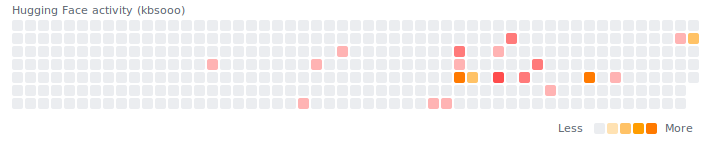

# HF Grass Widget

Generate a Hugging Face activity heatmap SVG you can embed in a GitHub README.

## Quick start

```bash
python3 scripts/hf_grass.py --user YOUR_HF_USERNAME --out assets/hf-grass.svg
```

To align daily buckets with KST midnight:

```bash
python3 scripts/hf_grass.py --user YOUR_HF_USERNAME --out assets/hf-grass.svg --tz-offset 9
```

## Embed in README

```md

```

The SVG is generated; run the script or workflow to create it.

## Example (kbsooo)


## Automation (GitHub Actions)

1. Set a repository variable named `HF_USERNAME`.
2. Run the workflow in `.github/workflows/hf-grass.yml` (or wait for the schedule).

For public repos, this workflow is free on GitHub-hosted runners.

## Notes

- The generator uses `https://huggingface.co/api/recent-activity`.
- Use `--activity-type` to filter: `all`, `discussion`, `upvote`, or `like`.
- Add `--show-legend` for a Less/More legend.
- Use `--theme` to switch palette/background: `light` (default) or `github-dark`.
- Add `--plot` to save a preview PNG (requires `matplotlib`).
- Use `--tz-offset` to shift daily buckets (e.g., `9` for KST).
- Days with only upvotes/likes use a red palette.
